# RocketMQ与Prometheus的集成与实现
                    冯庆执稿 陈厚道审阅
本文将对RocketMQ-Exporter的设计实现做一个简单的介绍，读者可以通过本文了解到RocketMQ-Exporter的实现过程，以及通过RocketMQ-Exporter来搭建自己的RocketMQ监控系统。该项目的git 地址[https://github.com/apache/rocketmq-exporter](https://github.com/apache/rocketmq-exporter)


文章主要内容包含以下几个方面：
1. RoceketMQ介绍
2. Prometheus简介
3. RocketMQ-Exporter的具体实现
4. RocketMQ-Exporter的监控指标和告警指标
5. RocketMQ-Exporter使用示例

## RoceketMQ介绍
RocketMQ是一个分布式消息和流数据平台，具有低延迟、高性能、高可靠性、万亿级容量和灵活的可扩展性。简单的来说，它由Broker服务器和客户端两部分组成，其中客户端一个是消息发布者客户端(Producer)，它负责向Broker服务器发送消息；另外一个是消息的消费者客户端(Consumer)，多个消费者可以组成一个消费组，来订阅和拉取消费Broker服务器上存储的消息。正由于它具有高性能、高可靠性和高实时性的特点，与其他协议组件在MQTT等各种消息场景中的结合也越来越多，应用越来越广泛。而对于这样一个强大的消息中间件平台，在实际使用的时候还缺少一个监控管理平台。而当前在开源界，使用最广泛监控解决方案的就是Prometheus。与其它传统监控系统相比较，Prometheus具有易于管理，监控服务的内部运行状态，强大的数据模型，强大的查询语言PromQL，高效的数据处理，可扩展，易于集成，可视化，开放性等优点。并且借助于Prometheus可以很快速的构建出一个能够监控RocketMQ的监控平台。

## Prometheus简介
下图展示了Prometheus的基本架构：
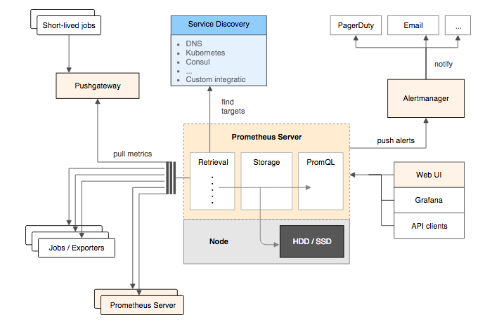

### Prometheus Server
Prometheus Server是Prometheus组件中的核心部分，负责实现对监控数据的获取，存储以及查询。 Prometheus Server可以通过静态配置管理监控目标，也可以配合使用Service Discovery的方式动态管理监控目标，并从这些监控目标中获取数据。其次Prometheus Server需要对采集到的监控数据进行存储，Prometheus Server本身就是一个时序数据库，将采集到的监控数据按照时间序列的方式存储在本地磁盘当中。最后Prometheus Server对外提供了自定义的PromQL语言，实现对数据的查询以及分析。
### Exporters
Exporter将监控数据采集的端点通过HTTP服务的形式暴露给Prometheus Server，Prometheus Server通过访问该Exporter提供的Endpoint端点，即可获取到需要采集的监控数据。RocketMQ-Exporter就是这样一个Exporter，它首先从RocketMQ集群采集数据，然后借助Prometheus提供的第三方客户端库将采集的数据规范化成符合Prometheus系统要求的数据，Prometheus定时去从Exporter拉取数据即可。当前RocketMQ Exporter已被Prometheus官方收录，其地址为 [https://github.com/apache/rocketmq-exporter](https://prometheus.io/docs/instrumenting/exporters/)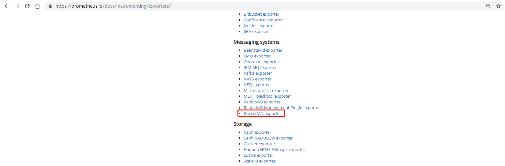

## RocketMQ-Exporter的具体实现
当前在Exporter当中，实现原理如下图所示：
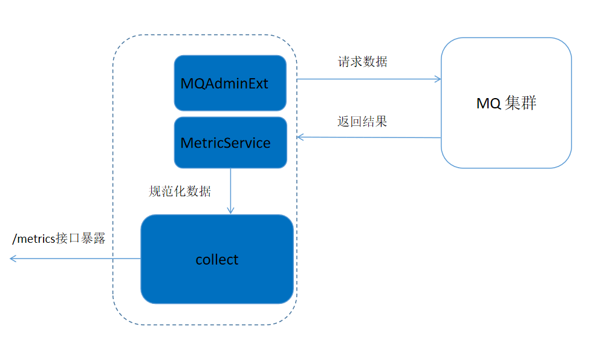
整个系统基于spring boot框架来实现。由于MQ内部本身提供了比较全面的数据统计信息，所以对于Exporter而言，只需要将MQ集群提供的统计信息取出然后进行加工而已。所以RocketMQ-Exporter的基本逻辑是内部启动多个定时任务周期性的从MQ集群拉取数据，然后将数据规范化后通过端点暴露给Prometheus即可。其中主要包含如下主要的三个功能部分：

- MQAdminExt模块通过封装MQ系统客户端提供的接口来获取MQ集群内部的统计信息。
- MetricService负责将MQ集群返回的结果数据进行加工，使其符合Prometheus要求的格式化数据。
- Collect模块负责存储规范化后的数据，最后当Prometheus定时从Exporter拉取数据的时候，Exporter就将Collector收集的数据通过HTTP的形式在/metrics端点进行暴露。

## RocketMQ-Exporter的监控指标和告警指标
RocketMQ-Exporter主要是配合Prometheus来做监控，下面来看看当前在Expoter中定义了哪些监控指标和告警指标

- 监控指标

监控指标 | 含义 | 
---|---|---
rocketmq_broker_tps          | broker每秒生产消息数量 
rocketmq_broker_qps          | broker每秒消费消息数量 
rocketmq_producer_tps        | 某个topic每秒生产的消息数量
rocketmq_producer_put_size   | 某个topic每秒生产的消息大小(字节)
rocketmq_producer_offset     | 某个topic的生产消息的进度
rocketmq_consumer_tps        | 某个消费组每秒消费的消息数量
rocketmq_consumer_get_size   | 某个消费组每秒消费的消息大小(字节)
rocketmq_consumer_offset     | 某个消费组的消费消息的进度
rocketmq_group_get_latency_by_storetime | 某个消费组的消费延时时间
消息堆积量（rocketmq_producer_offset-rocketmq_consumer_offset）     | 消息堆积量（生产进度-消费进度）

- 告警指标

告警指标 | 含义 | 
---|---|---
sum(rocketmq_producer_tps) by (cluster) >= 10          | 集群发送tps太高
sum(rocketmq_producer_tps) by (cluster) < 1            | 集群发送tps太低 
sum(rocketmq_consumer_tps) by (cluster) >= 10          | 集群消费tps太高
sum(rocketmq_consumer_tps) by (cluster) < 1            | 集群消费tps太低
rocketmq_group_get_latency_by_storetime > 1000         | 集群消费延时告警
消费者堆积告警指标           | 消费堆积

告警指标设置的值只是个阈值只是象征性的值，用户可根据在实际使用RocketMQ的情况下自行设定。这里重点介绍一下消费者堆积告警指标，在以往的监控系统中，由于没有像Prometheus那样有强大的PromQL语言，在处理消费者告警问题时势必需要为每个消费者设置告警，那这样就需要RocketMQ系统的维护人员为每个消费者添加，要么在系统后台检测到有新的消费者创建时自动添加。在Prometheus中，这可以通过一条如下的语句来实现：

```
(sum(rocketmq_producer_offset) by (topic) - on(topic)  group_right  sum(rocketmq_consumer_offset) by (group,topic)) 
- ignoring(group) group_left sum (avg_over_time(rocketmq_producer_tps[5m])) by (topic)*5*60 > 0

```
借助PromQL这一条语句不仅可以实现为任意一个消费者创建消费告警堆积告警，而且还可以使消费堆积的阈值取一个跟生产者发送速度相关的阈值。这样大大增加了消费堆积告警的准确性。

## RocketMQ-Exporter使用示例

1 启动NameServer和Broker

要验证RocketMQ的Spring-Boot客户端，首先要确保RocketMQ服务正确的下载并启动。可以参考RocketMQ主站的快速开始来进行操作。确保启动NameServer和Broker已经正确启动。

2 编译RocketMQ-Exporter
用户当前使用，需要自行下载git源码编译

```
git clone https://github.com/apache/rocketmq-exporter
cd rocketmq-exporter
mvn clean install
```
3 配置和运行
RocketMQ-Exporter 有如下的运行选项
选项 | 默认值 | 含义
---|---|---
rocketmq.config.namesrvAddr | 127.0.0.1:9876 | MQ集群的nameSrv地址
rocketmq.config.webTelemetryPath | /metrics | 指标搜集路径
server.port | 5557 | HTTP服务暴露端口
以上的运行选项既可以在下载代码后在配置文件中更改，也可以通过命令行来设置。
编译出来的jar包就叫rocketmq-exporter-0.0.1-SNAPSHOT.jar，可以通过如下的方式来运行。

```
java -jar rocketmq-exporter-0.0.1-SNAPSHOT.jar [--rocketmq.config.namesrvAddr="127.0.0.1:9876" ...]
```

4 安装Prometheus
首先到Prometheus官方下载地址:[https://prometheus.io/download/](https://prometheus.io/download/)去下载Prometheus安装包，当前以linux的安装为例，选择的安装包为
prometheus-2.7.0-rc.1.linux-amd64.tar.gz，经过如下的操作步骤就可以启动prometheus进程。

```
tar -xzf prometheus-2.7.0-rc.1.linux-amd64.tar.gz
cd prometheus-2.7.0-rc.1.linux-amd64/
./prometheus --config.file=prometheus.yml --web.listen-address=:5555
```
prometheus 默认监听端口号为9090，为了不与系统上的其它进程监听端口冲突，我们在启动参数里面重新设置了监听端口号为5555。然后通过浏览器访问http://<服务器IP地址>:5555,就可以验证prometheus是否已成功安装，显示界面如下：
由于RocketMQ-Exporter进程已启动，这个时候可以通过prometheus来抓取RocketMQ-Exporter的数据，这个时候只需要更改prometheus启动的配置文件即可
整体配置文件如下：

```
# my global config
global:
   scrape_interval:     15s # Set the scrape interval to every 15 seconds. Default is every 1 minute.
   evaluation_interval: 15s # Evaluate rules every 15 seconds. The default is every 1 minute.
   # scrape_timeout is set to the global default (10s).
 
 
 # Load rules once and periodically evaluate them according to the global 'evaluation_interval'.
 rule_files:
   # - "first_rules.yml"
   # - "second_rules.yml"
   

 scrape_configs:
   - job_name: 'prometheus'
     static_configs:
     - targets: ['localhost:5555']
   
   
   - job_name: 'exporter'
     static_configs:
     - targets: ['localhost:5557']
```
更改配置文件后，重启即可。

5 Grafana dashboard for RocketMQ

Prometheus自身的指标展示平台没有当前流行的展示平台Grafana好， 为了更好的展示RocketMQ的指标，可以使用Grafana来展示Prometheus获取的指标。首先到官网去下载[https://grafana.com/grafana/download](https://grafana.com/grafana/download), 这里仍以二进制文件安装为例进行介绍。

```
wget https://dl.grafana.com/oss/release/grafana-6.2.5.linux-amd64.tar.gz 
tar -zxvf grafana-6.2.5.linux-amd64.tar.gz
cd grafana-5.4.3/
```
同样为了不与其它进程的端口冲突，可以修改conf目录下的defaults.ini文件的监听端口，当前将这个grafana的监听端口改为55555，然后使用如下的命令启动即可

```
./bin/grafana-server web
```
然后通过浏览器访问http://<服务器IP地址>:55555,就可以验证grafana是否已成功安装。系统默认用户名和密码为admin/admin，第一次登陆系统会要求修改密码，修改密码后登陆，界面显示如下：

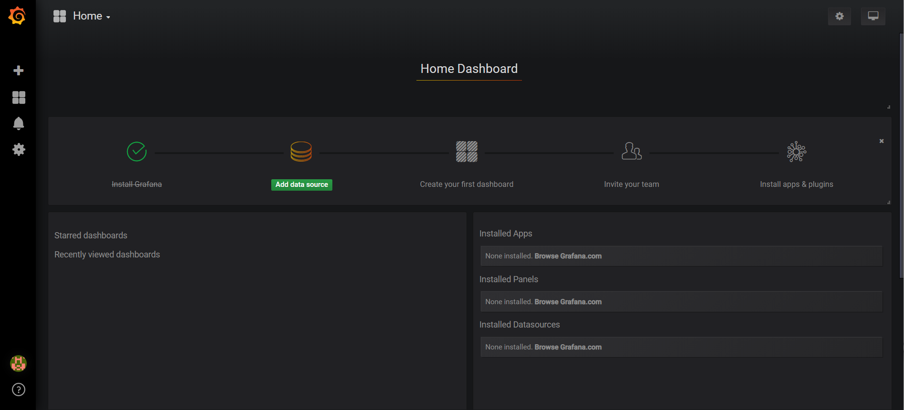

点击Add data source 按钮，会要求选择数据源。

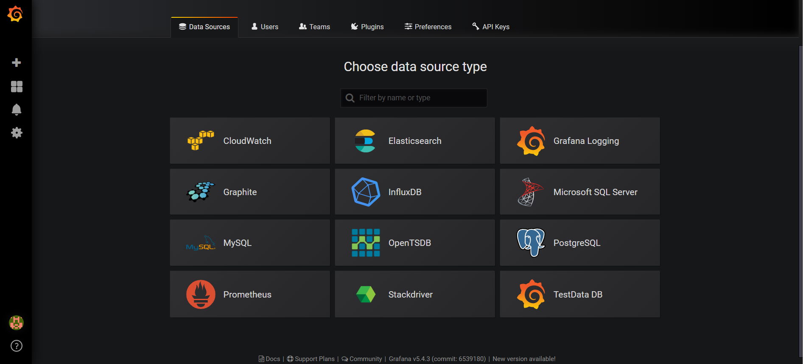

选择数据源为Prometheus，设置数据源的地址为前面步骤启动的Prometheus的地址

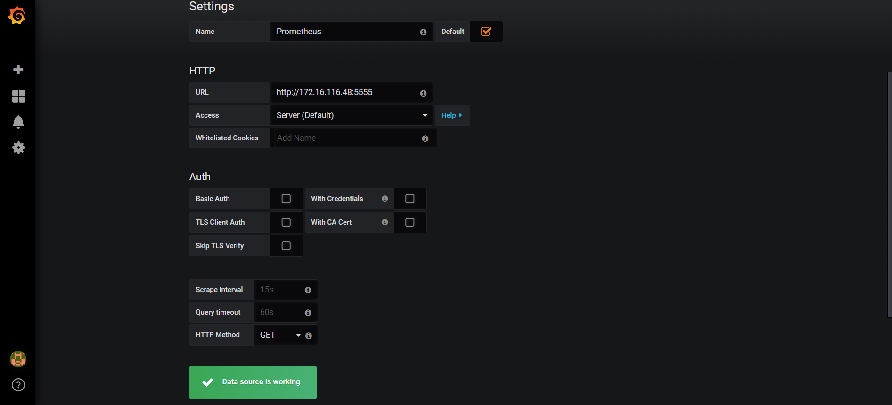

回到主界面会要求创建新的Dashboard

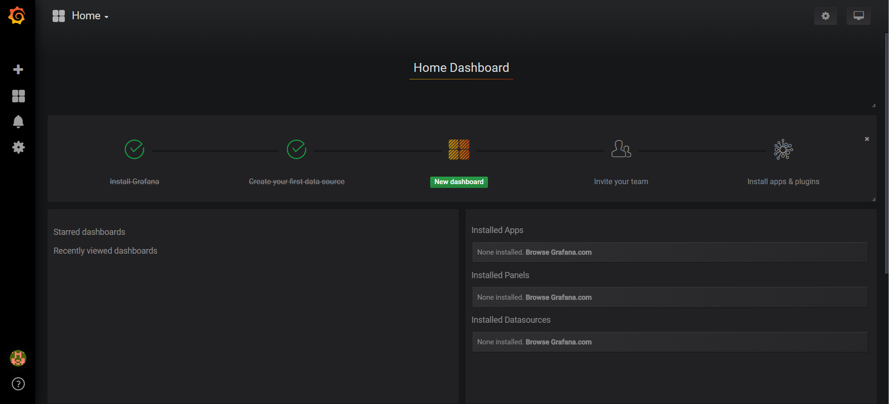

点击创建dashboard，创建dashboard可以自己手动创建，也可以以配置文件导入的方式创建，当前已将RocketMQ的dashboard配置文件上传到Grafana的官网，这里以配置文件导入的方式进行创建。

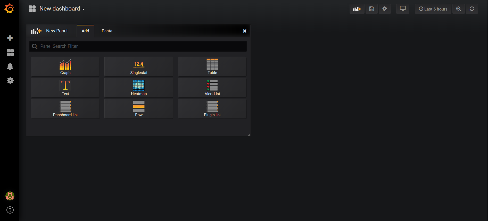

点击New dashboard下拉按钮

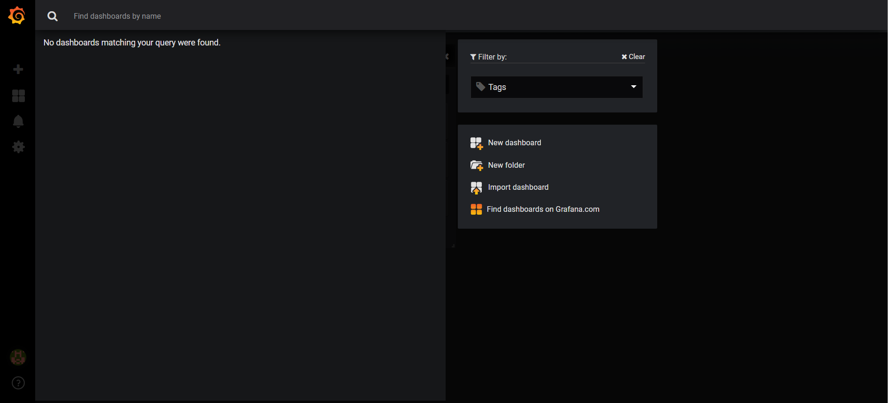

选择import dashboard

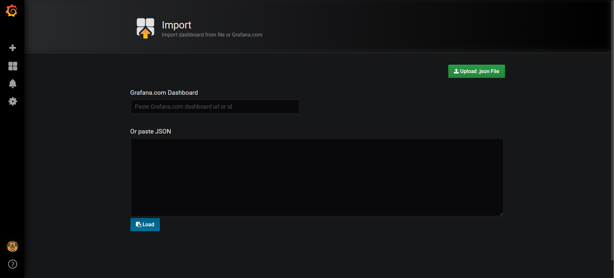

这个时候可以到Grafana官网去下载配置文件，地址为[https://grafana.com/dashboards/10477/revisions](https://grafana.com/dashboards/10477/revisions)去下载dashboard配置文件，如图所示，点击download就可以下载配置文件，下载配置文件然后，复制配置文件中的内容粘贴到上图的粘贴内容处。

最后按如下的方式配置就将RocketMQ的 dashboard给导入了。

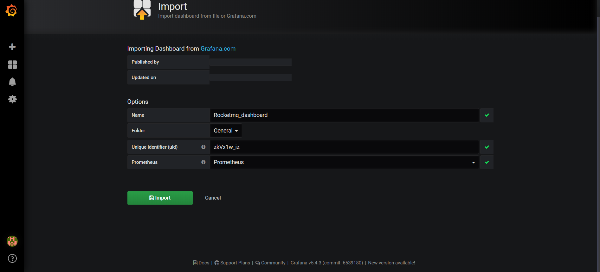

最终的效果如下所示：

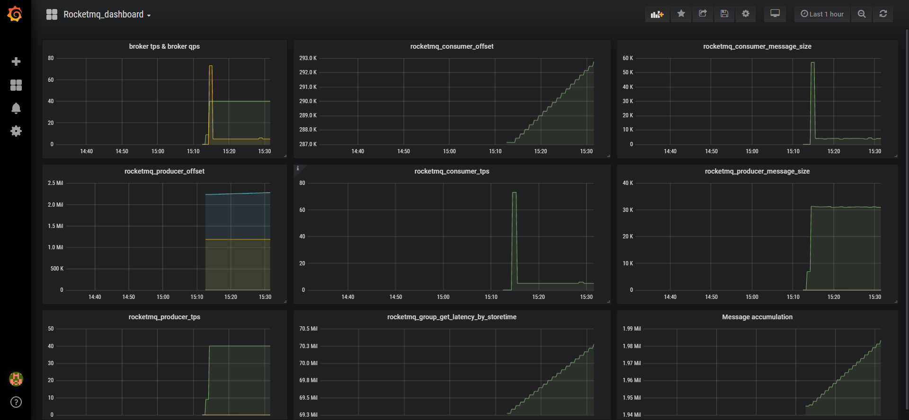


